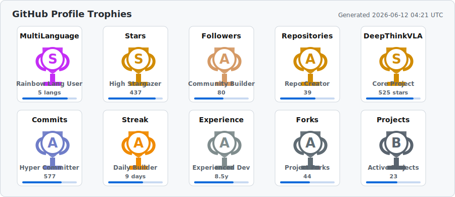
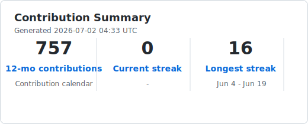

# wadeKeith / README.md

  

<!-- PROFILE:START -->
<!-- This section is generated by scripts/update_readme.py. -->

  

## Snapshot

| Public repos | Project repos | Stars | Forks | Followers | Following |
| ---: | ---: | ---: | ---: | ---: | ---: |
| 42 | 25 | 450 | 44 | 82 | 15 |

## Activity

  
  

  

## Featured Repositories

| Repository | Description | Language | Stars | Updated |
| --- | --- | --- | ---: | --- |
| [OpenBMB/DeepThinkVLA](https://github.com/OpenBMB/DeepThinkVLA) | DeepThinkVLA: Enhancing Reasoning Capability of Vision-Language-Action Models | Python | 527 | 2026-07-12 |
| [Awesome-Embodied-AI](https://github.com/wadeKeith/Awesome-Embodied-AI) | Curated embodied AI list: surveys, VLA models, datasets, simulators, humanoids, robot learning, and safety resources. | Python | 228 | 2026-07-20 |
| [autoresearch-qwen](https://github.com/wadeKeith/autoresearch-qwen) | Autonomous Qwen3-VL training-code research on the official DocVQA benchmark. main: NVIDIA multi-GPU, mlx: Apple Silicon/MPS. | Python | 211 | 2026-06-14 |
| [DeepThinkVLA_libero_plus](https://github.com/wadeKeith/DeepThinkVLA_libero_plus) | DeepThinkVLA: Enhancing Reasoning Capability of Vision-Language-Action Models | Python | 3 | 2026-05-26 |
| [dualkey-agent](https://github.com/wadeKeith/dualkey-agent) | Approvals, deterministic policy, and signed receipts for AI agent actions. | Python | 2 | 2026-05-26 |
| [Dual-Robot-Manipulation-Sandbox](https://github.com/wadeKeith/Dual-Robot-Manipulation-Sandbox) | - | C++ | 2 | 2026-04-14 |
| [UR5e_with_RL](https://github.com/wadeKeith/UR5e_with_RL) | - | Python | 2 | 2026-04-14 |

## Recently Active Public Repositories

| Repository | Description | Language | Stars | Updated |
| --- | --- | --- | ---: | --- |
| [Awesome-Embodied-AI](https://github.com/wadeKeith/Awesome-Embodied-AI) | Curated embodied AI list: surveys, VLA models, datasets, simulators, humanoids, robot learning, and safety resources. | Python | 228 | 2026-07-20 |
| [zk](https://github.com/wadeKeith/zk) | - | Python | 0 | 2026-06-26 |
| [wadeKeith.github.io](https://github.com/wadeKeith/wadeKeith.github.io) | Personal homepage for Cheng Yin | JavaScript | 0 | 2026-06-19 |
| [LLM_Book](https://github.com/wadeKeith/LLM_Book) | - | TeX | 0 | 2026-06-14 |
| [autoresearch-qwen](https://github.com/wadeKeith/autoresearch-qwen) | Autonomous Qwen3-VL training-code research on the official DocVQA benchmark. main: NVIDIA multi-GPU, mlx: Apple Silicon/MPS. | Python | 211 | 2026-06-14 |

Last generated: 2026-07-21 03:51 UTC
<!-- PROFILE:END -->

## About

I work on embodied AI, vision-language-action models, robot learning, reinforcement learning, and autonomous research tooling.

Personal website: [www.yincheng429.cn](http://www.yincheng429.cn).

Current focus areas:

- Core project: [OpenBMB/DeepThinkVLA](https://github.com/OpenBMB/DeepThinkVLA), enhancing reasoning capability of vision-language-action models.
- VLA training and evaluation pipelines for robot manipulation.
- Reasoning-oriented robot policies, recovery, clarification, horizon, and safe-abort evaluation.
- Lightweight autonomous research agents for benchmark-driven model development.

## Links

- Website: [www.yincheng429.cn](http://www.yincheng429.cn)
- Repositories: [wadeKeith](https://github.com/wadeKeith?tab=repositories)
- Core project: [OpenBMB/DeepThinkVLA](https://github.com/OpenBMB/DeepThinkVLA)
- Curated list: [Awesome-Embodied-AI](https://github.com/wadeKeith/Awesome-Embodied-AI)
- Research tooling: [autoresearch-qwen](https://github.com/wadeKeith/autoresearch-qwen)

<!--
Auto-maintained by .github/workflows/update-profile.yml.
Edit text outside PROFILE markers for persistent manual changes.
-->
