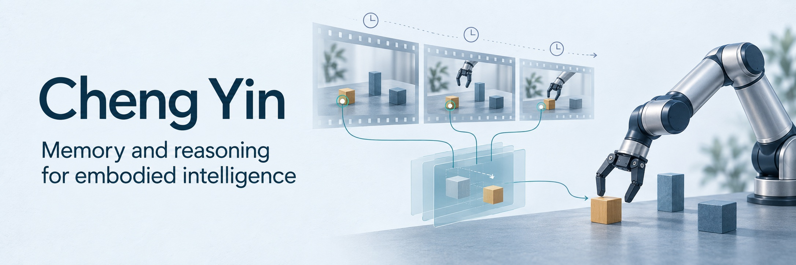

  

  <a href="https://yincheng429.cn">Website</a> ·
  <a href="https://scholar.google.com/citations?user=Qc0js-IAAAAJ&amp;hl=en">Google Scholar</a> ·
  <a href="https://orcid.org/0009-0001-7171-3257">ORCID</a> ·
  <a href="https://huggingface.co/yinchenghust">Hugging Face</a> ·
  <a href="https://modelscope.cn/profile/keithyc">ModelScope</a> ·
  <a href="mailto:yinchenghust@outlook.com">Email</a>

I am a Ph.D. researcher at HUST, undertaking joint research training with Tsinghua THUNLP and Beijing Zhongguancun Academy. I study how robots use past observations and reasoning to choose their next action, with a focus on vision-language-action models, long-horizon robot learning, and reproducible research systems.

## Selected Research

My research connects two questions: **what evidence should remain available to a robot, and how should reasoning influence its actions?** SimpleMemVLA studies access to visual history; DeepThinkVLA studies the conditions under which explicit reasoning improves control.

### [SimpleMemVLA](https://github.com/wadeKeith/SimpleMemVLA)

*A Simple but Effective Native-Video Memory for Vision-Language-Action Models*

*First-author research · arXiv preprint, September 2026*

**The question.** A robot may need information that disappeared from view a minute ago: where an object was hidden, how many times a button was pressed, or which sequence it should repeat. Retrieval, compression, and recurrent memory introduce intermediate representations that can discard evidence before a future decision reveals its importance. Can a pretrained video-language model use visual context itself as memory?

**The approach.** SimpleMemVLA supplies a bounded, low-rate history through the backbone's native timestamped-video interface, without a dedicated memory module. At each decision, the backbone generates a short subtask description. That answer span's contextual hidden states, fused with token embeddings, form the history-to-action interface; a flow-matching action expert also receives proprioception and predicts a continuous action chunk. Shared-prefix prefilling reuses history computation while the current chunk executes, reducing the latency of the next decision.

**The evidence.** The paper reports the following results, with one multitask checkpoint per benchmark rather than a single checkpoint shared across all benchmarks:

| Memory benchmark | Reported result | Evaluation scope |
| --- | ---: | --- |
| RMBench | **94.0% success** | Nine comparable tasks; 100 seeds per task |
| RoboMME | **88.3% success** | 16 tasks; 50 episodes per task |
| MIKASA-Robo | **74.0% success** | Five tasks; 100 canonical seeds per task |
| RoboMemArena | **63.6% TSR** | 26 tasks; 51 rollouts per task |

**Why it matters.** The work shifts evidence selection toward decision time: sampled observations remain available for native attention to query when their relevance becomes clear.

Controlled comparisons, efficiency, and scope

- With the backbone, data, supervision, action head, and optimization held fixed on RoboMME, retrieval, compression, and recurrent-state variants achieve 31.5%, 22.6%, and 20.6%, respectively, versus 88.3% for native video history.
- General-control results are 97.5% on LIBERO and 78.4% zero-shot on LIBERO-Plus. These are separate evaluations, not additional memory benchmarks.
- On one H100 in BF16 at batch size 1, shared-prefix streaming reduces decision latency with 60 seconds of history from 1.02 s to 0.68 s.
- RMBench's 94.0% excludes Place-Mat, which lacks a comparable public baseline; the published baselines use task-specific specialists. Results here are author-reported closed-loop simulation results, not a completed real-robot validation.

[Paper](https://arxiv.org/abs/2609.05533) · [Code](https://github.com/wadeKeith/SimpleMemVLA) · [Models & data](https://github.com/wadeKeith/SimpleMemVLA#-data--checkpoints)

### [DeepThinkVLA](https://github.com/OpenBMB/DeepThinkVLA)

*Enhancing Reasoning Capability of Vision-Language-Action Models*

*First-author research*

**The question.** Does chain-of-thought (CoT) actually improve a robot's decisions, or merely produce plausible explanations and extra latency? DeepThinkVLA separates two requirements: language and actions need suitable decoding mechanisms, and the reasoning-action chain needs to be aligned with task outcomes.

**The approach.** A hybrid-attention decoder generates natural-language reasoning autoregressively, then switches to bidirectional attention for parallel action-chunk prediction. Actions can attend to the preceding reasoning without being forced through the same sequential decoding process. Training starts with supervised fine-tuning on embodied CoT annotations, followed by online GRPO with sparse task-success rewards, a small format reward, and KL regularization. SFT supplies the initial behavior; RL optimizes the reasoning-action chain against outcomes rather than rewarding intermediate reasoning semantics directly.

**The evidence.** The paper reports strong standard-task performance and evaluates robustness without adapting to LIBERO-Plus:

| Benchmark | Reported success | Evaluation scope |
| --- | ---: | --- |
| LIBERO | **97.0%** | RL-aligned; four suites, 50 initial conditions per task |
| LIBERO-Plus | **79.0%** | SFT-only checkpoint; zero-shot across seven perturbation categories |
| RoboTwin 2.0 | **59.3%** | RL-aligned; 12 tasks spanning short to very long horizons |

**Why it matters.** The central result is conditional: adding reasoning text is not enough. The decoding design and outcome-based training must make that reasoning useful to control, especially when execution conditions change.

What the ablations establish—and what they do not

- On LIBERO-Plus, the RL-aligned checkpoint scores 79.1% versus 79.0% for SFT-only. This checks preservation of perception/instruction-side robustness; the dynamics-shift study below tests the action relevance of reasoning.
- Naively adding CoT to a fully autoregressive decoder reduces success from 85.5% to 81.3% and increases latency to 4.0× in the decoding ablation.
- Under Joint-Limit dynamics shift, SFT-only CoT loses 32.0 percentage points, close to the reasoning-free baseline's 31.6-point drop. RL alignment reduces the drop to 24.4 points; masking CoT increases it again to 27.7 points.
- These interventions support a functional influence of reasoning on actions; they do not establish a complete mechanistic explanation or show that CoT is necessary at every step.
- The real-robot study is preliminary: three AGILEX ALOHA tasks, 20 trials each, using SFT-only policies. It does not validate the full online-RL pipeline on physical robots.

[Paper](https://arxiv.org/abs/2511.15669) · [Code](https://github.com/OpenBMB/DeepThinkVLA) · [Models & data](https://huggingface.co/collections/yinchenghust/deepthinkvla)

## Public Contributions

The following are collaborative projects to which I contribute. Their capabilities and results belong to the respective project teams.

### [SimpleNav](https://github.com/OpenBMB/SimpleNav)

*Public contributor · Navigation research infrastructure*

**The problem.** Navigation datasets differ in coordinate systems, action definitions, simulators, and evaluation protocols. Rebuilding the entire stack for each benchmark makes model comparisons and reuse difficult.

**How it works.** SimpleNav connects data conversion, trajectory augmentation, long-history VLA modeling, configuration-driven training, and benchmark-specific evaluation. Dedicated adapters preserve each dataset's semantics while shared interfaces standardize model inputs, action artifacts, and rollout records. The reference model combines a Qwen3.5-VL backbone, temporal-view context, selected visual history, and a continuous action head.

**What it enables.** The public release provides separate training and closed-loop evaluation workflows for six aerial and ground navigation benchmarks, including OpenFly, TravelUAV, AerialVLN, EVT-Bench, R2R-CE, and RxR-CE. Its focus is a reusable, traceable research loop—not a safety-certified flight-control system.

[Code & documentation](https://github.com/OpenBMB/SimpleNav) · [Project & demos](https://simplenav.github.io/)

### [MiniCPM-Robot](https://github.com/OpenBMB/MiniCPM-Robot)

*Public contributor · Efficient embodied models*

**The problem.** Deployable robot policies must balance task capability, visual context, model size, and end-to-end response time. MiniCPM-Robot explores this balance through two complementary models.

**How it works.** MiniCPM-RobotManip is a 1.5B generalist manipulation policy with one set of weights across downstream tasks, compressed visual tokens, and streaming visual history. MiniCPM-RobotTrack is a 0.9B vision-language-action tracker that combines curated trajectory data with DAgger-style collection and correction of difficult interactions.

**What it demonstrates.** The manipulation release reports 97.5% on LIBERO and provides evaluation integrations for CALVIN, RoboTwin2, and RMBench. The tracking release supports fully local, language-conditioned visual tracking on Unitree Go2 EDU, with reported end-to-end operation above 5 FPS at approximately 180 ms latency. These are different models and evaluation settings, not one shared latency or performance claim.

[Code, model zoo & benchmarks](https://github.com/OpenBMB/MiniCPM-Robot)

### [starVLA](https://github.com/starVLA/starVLA)

*Public contributor · Modular VLA research systems*

**The problem.** Testing a new VLA backbone or action representation should not require rewriting data loading, training, deployment, and evaluation together.

**How it works.** starVLA separates foundation-model backbones, action heads, data interfaces, and training infrastructure. Its interchangeable variants cover autoregressive action tokens (FAST), parallel continuous prediction (OFT), flow-matching action experts, and GR00T-style dual-system models. Shared interfaces also support supervised training, multimodal and cross-embodiment co-training, and integrations for RL post-training.

**What it enables.** Researchers can swap one component while reusing the surrounding experiment pipeline, then evaluate across supported manipulation benchmarks and robot integrations. The repository distinguishes the actively changing development branch from the stable branch used for verified results, making reproducibility part of the workflow rather than an afterthought.

[Code & documentation](https://github.com/starVLA/starVLA) · [Stable branch](https://github.com/starVLA/starVLA/tree/starVLA) · [Technical report](https://arxiv.org/abs/2604.05014)

## Open Work & Resources

| Project | Relationship | What it provides |
| --- | --- | --- |
| [Awesome-Embodied-AI](https://github.com/wadeKeith/Awesome-Embodied-AI) | `MAINTAINED PUBLIC PROJECT` | A curated map of embodied-AI papers, datasets, simulators, toolkits, and safety resources. |
| [autoresearch-qwen](https://github.com/wadeKeith/autoresearch-qwen) | `MAINTAINED PUBLIC PROJECT` | An autonomous research loop for improving Qwen3-VL on the public DocVQA benchmark. |
| [Large Language and Generative Foundation Models](https://github.com/wadeKeith/LLM_Book) | `MAINTAINED PUBLIC PROJECT` | A bilingual, publicly released book manuscript on large language and generative foundation models. |

<!-- PROFILE:START -->
<!-- This section is generated by scripts/update_readme.py. -->
## GitHub Activity

| Public projects | Stars · owned + contributed repos | Contributions · last 12 months |
| ---: | ---: | ---: |
| 26 | 584,089 | 1,049 |

Public GitHub data · repository stars include owned and verified contributed projects · refreshed 2026-09-10 04:53 UTC
<!-- PROFILE:END -->

<!--
The activity section is maintained by .github/workflows/update-profile.yml.
Curated research content lives outside the PROFILE markers and is never overwritten by automation.
-->
