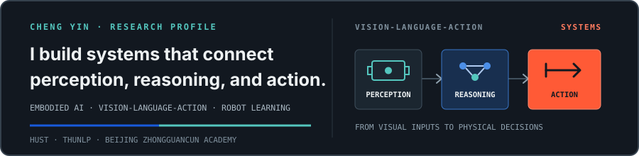

  

  <a href="https://yincheng429.cn">Website</a> ·
  <a href="https://scholar.google.com/citations?user=Qc0js-IAAAAJ&amp;hl=en">Google Scholar</a> ·
  <a href="https://orcid.org/0009-0001-7171-3257">ORCID</a> ·
  <a href="https://huggingface.co/yinchenghust">Hugging Face</a> ·
  <a href="https://modelscope.cn/profile/keithyc">ModelScope</a> ·
  <a href="mailto:yinchenghust@outlook.com">Email</a>

I am a Ph.D. researcher at HUST, undertaking joint research training with Tsinghua THUNLP and Beijing Zhongguancun Academy. My work focuses on embodied AI, vision-language-action models, robot learning, reasoning-oriented control, and the research systems that make these models easier to train and evaluate.

## Selected Research

### [DeepThinkVLA](https://github.com/OpenBMB/DeepThinkVLA)

`FIRST-AUTHOR RESEARCH`

DeepThinkVLA studies when explicit reasoning improves robot action. It reports a **97.0% average success rate on LIBERO** and a **79.0% zero-shot success rate on LIBERO-Plus**.

[Paper](https://arxiv.org/abs/2511.15669) · [Code](https://github.com/OpenBMB/DeepThinkVLA) · [Models & data](https://huggingface.co/collections/yinchenghust/deepthinkvla)

## Public Contributions

| Project | Relationship | Focus |
| --- | --- | --- |
| [OpenBMB/SimpleNav](https://github.com/OpenBMB/SimpleNav) | `PUBLIC CONTRIBUTOR` | A unified, reproducible framework for navigation VLA research. |
| [OpenBMB/MiniCPM-Robot](https://github.com/OpenBMB/MiniCPM-Robot) | `PUBLIC CONTRIBUTOR` | An on-device embodied model family for robot manipulation and target tracking. |
| [starVLA/starVLA](https://github.com/starVLA/starVLA) | `PUBLIC CONTRIBUTOR` | A modular platform for developing and evaluating VLA systems. |

## Open Work & Resources

| Project | Relationship | What it provides |
| --- | --- | --- |
| [Awesome-Embodied-AI](https://github.com/wadeKeith/Awesome-Embodied-AI) | `MAINTAINED PUBLIC PROJECT` | A curated map of embodied-AI papers, datasets, simulators, toolkits, and safety resources. |
| [autoresearch-qwen](https://github.com/wadeKeith/autoresearch-qwen) | `MAINTAINED PUBLIC PROJECT` | An autonomous research loop for improving Qwen3-VL on the public DocVQA benchmark. |
| [Large Language and Generative Foundation Models](https://github.com/wadeKeith/LLM_Book) | `MAINTAINED PUBLIC PROJECT` | A bilingual, publicly released book manuscript on large language and generative foundation models. |

<!-- PROFILE:START -->
<!-- This section is generated by scripts/update_readme.py. -->
## GitHub Activity

| Public projects | Stars · owned + contributed repos | Contributions · last 12 months |
| ---: | ---: | ---: |
| 25 | 578,145 | 1,010 |

Public GitHub data · repository stars include owned and verified contributed projects · refreshed 2026-08-31 10:53 UTC
<!-- PROFILE:END -->

<!--
The activity section is maintained by .github/workflows/update-profile.yml.
Curated research content lives outside the PROFILE markers and is never overwritten by automation.
-->
